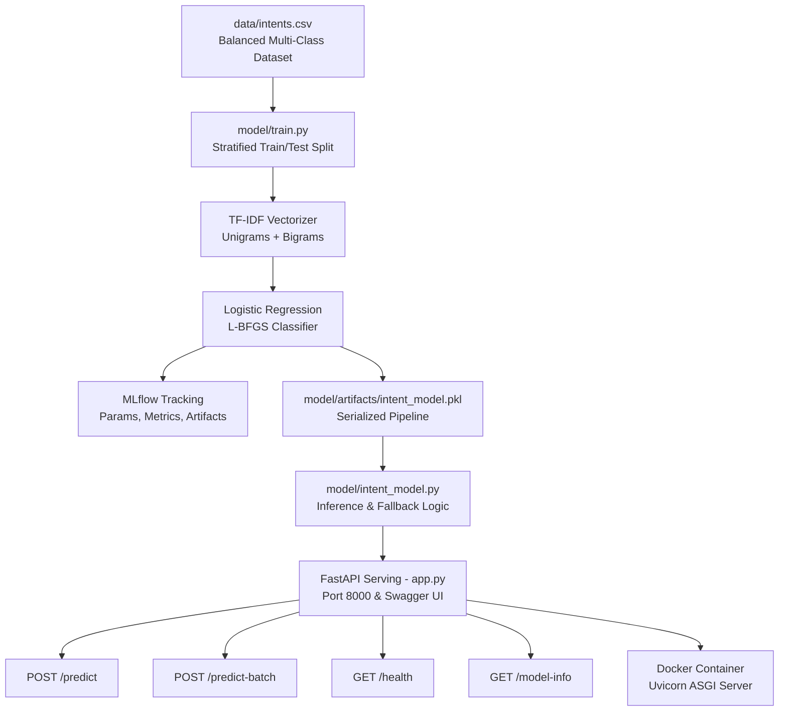

# 🚀 Intent Classifier MLOps Production Pipeline

**Author**: **Manjunath**  
**Version**: 1.0.0  
**License**: MIT  

A production-grade, end-to-end Machine Learning Operations (MLOps) pipeline for real-time customer intent classification. Built with **Scikit-learn**, **MLflow**, **FastAPI**, **Pydantic**, **Pytest**, and **Docker**.

---

## 📌 Architecture Overview



---

## ✨ Features

- **Multi-Class Intent Classification**: Recognizes customer intents:
  - `greeting` (e.g., "hello", "good morning")
  - `goodbye` (e.g., "bye", "talk to you soon")
  - `cancel_subscription` (e.g., "cancel my membership")
  - `order_status` (e.g., "where is my delivery?")
  - `refund_request` (e.g., "I want my money back")
  - `billing_inquiry` (e.g., "why was I charged twice?")
  - `technical_support` (e.g., "cannot reset password")
  - `praise` (e.g., "great customer service")
- **Confidence Thresholding & Fallback**: Out-of-vocabulary or low-confidence queries automatically flag `is_fallback: true` and route to `"fallback"` instead of forcing an incorrect category.
- **MLflow Experiment Tracking**: Tracks hyperparameters, accuracy, F1-scores, classification reports, and model versions.
- **FastAPI + Pydantic Serving**: Type-safe REST API with interactive Swagger docs at `/docs`.
- **High-Throughput Batch Processing**: Batch inference endpoint (`/predict-batch`) for processing multiple texts concurrently.
- **Automated Testing Suite**: Full unit and API integration test coverage using `pytest`.
- **Production Containerization**: Lightweight `Dockerfile` and `docker-compose.yml` for reproducible deployments.

---

## 🛠️ Quick Start Guide

### 1. Environment Setup

```bash
# Create and activate virtual environment
python -m venv .venv
.\.venv\Scripts\Activate.ps1   # Windows PowerShell
# or: source .venv/bin/activate  # Linux / macOS

# Install dependencies
pip install -r requirements.txt
```

### 2. Train the Model & Log to MLflow

```bash
python model/train.py
```

This will:
1. Load dataset from `data/intents.csv`.
2. Perform stratified train/test split.
3. Fit the TF-IDF + Logistic Regression pipeline.
4. Output evaluation metrics (Accuracy, Precision, Recall, F1).
5. Save model to `model/artifacts/intent_model.pkl`.
6. Log metrics and artifacts to local MLflow experiment `Intent-Classifier-Manjunath`.

To view your MLflow experiment dashboard:
```bash
mlflow ui
# Open http://127.0.0.1:5000 in your browser
```

### 3. Launch the FastAPI Serving Application

```bash
python app.py
# or: uvicorn app:app --host 0.0.0.0 --port 8000 --reload
```

- **Interactive Swagger UI**: [http://127.0.0.1:8000/docs](http://127.0.0.1:8000/docs)
- **ReDoc Documentation**: [http://127.0.0.1:8000/redoc](http://127.0.0.1:8000/redoc)
- **Health Check Probe**: [http://127.0.0.1:8000/health](http://127.0.0.1:8000/health)

---

## 📡 API Reference & Examples

### `POST /predict` (Single Prediction)
Classifies a single message and returns the predicted intent, confidence score, and full probability distribution across all classes.

**Request**:
```bash
curl -X POST "http://127.0.0.1:8000/predict" \
     -H "Content-Type: application/json" \
     -d '{"text": "I want to cancel my subscription", "confidence_threshold": 0.30}'
```

**Response**:
```json
{
  "text": "I want to cancel my subscription",
  "intent": "cancel_subscription",
  "confidence": 0.8241,
  "probabilities": {
    "cancel_subscription": 0.8241,
    "billing_inquiry": 0.0421,
    "refund_request": 0.0382,
    "technical_support": 0.0315,
    "order_status": 0.0241,
    "greeting": 0.0152,
    "goodbye": 0.0135,
    "praise": 0.0113
  },
  "is_fallback": false
}
```

---

### `POST /predict-batch` (Batch Prediction)
Classifies multiple messages in a single request.

**Request**:
```bash
curl -X POST "http://127.0.0.1:8000/predict-batch" \
     -H "Content-Type: application/json" \
     -d '{"texts": ["hello support", "where is my package?", "you guys are awesome"]}'
```

---

### `GET /model-info` (Metadata)
Returns model version, supported classes, and metadata.

**Response**:
```json
{
  "service_name": "Intent Classifier",
  "author": "Manjunath",
  "version": "1.0.0",
  "num_classes": 8,
  "classes": [
    "billing_inquiry",
    "cancel_subscription",
    "goodbye",
    "greeting",
    "order_status",
    "praise",
    "refund_request",
    "technical_support"
  ],
  "model_loaded": true
}
```

---

## 🧪 Running Automated Tests

Run the full test suite with `pytest`:

```bash
pytest -v
```

Tests cover:
- Model artifact serialization and inference.
- Handling empty/whitespace strings.
- Probability distribution normalization.
- Confidence thresholding & fallback logic.
- Batch inference accuracy.
- FastAPI endpoints (`/`, `/health`, `/model-info`, `/predict`, `/predict-batch`).
- Pydantic schema validation & error handling.

---

## 🐳 Docker Deployment

### Build and Run with Docker
```bash
# Build the Docker image
docker build -t intent-classifier-service:1.0 .

# Run the container on port 8000
docker run -d -p 8000:8000 --name intent-service intent-classifier-service:1.0
```

### Or with Docker Compose
```bash
docker compose up -d
```

Test the containerized API at `http://localhost:8000/docs`.

---

## 👨‍💻 Project Information

- **Author**: Manjunath
- **Repository**: `Intent-classifier-model-main`
- **Frameworks**: Python, Scikit-learn, MLflow, FastAPI, Pytest, Docker
