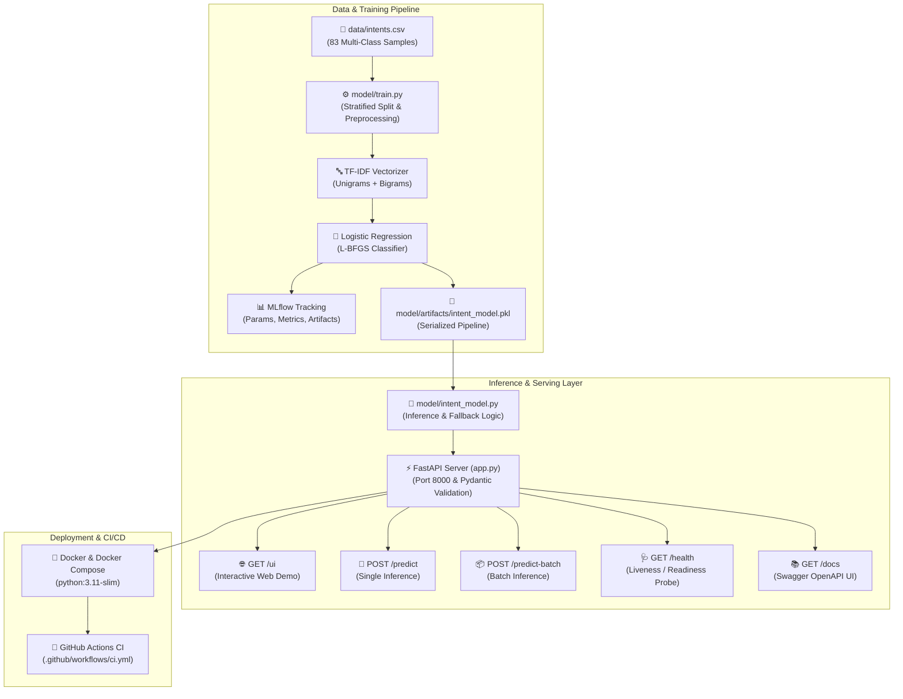

# 🚀 Intent Classifier MLOps Production Pipeline

<p align="center">
  
  
  
  
  
  
  
</p>

---

## 📖 Overview

The **Intent Classifier MLOps Production Pipeline** is an end-to-end machine learning system engineered by **Manjunath** to automatically classify incoming customer service inquiries and support requests into actionable business intents in real time.

The project features a **stratified TF-IDF + Multinomial Logistic Regression** model, full experiment tracking and model versioning with **MLflow**, high-performance **FastAPI** model serving with strict **Pydantic** schema validation, an interactive **Web Demo UI**, automated **Pytest** validation, and **Docker** containerization.

---

## 📌 Architecture & System Flow



---

## 📂 Project Directory Structure

```text
Intent-classifier-model-main/
├── .github/
│   └── workflows/
│       └── ci.yml               # Automated GitHub Actions test & build workflow
├── data/
│   └── intents.csv              # Balanced multi-class customer intent dataset
├── model/
│   ├── artifacts/
│   │   ├── intent_model.pkl     # Trained TF-IDF + Logistic Regression model
│   │   ├── metrics.json         # Evaluation metrics snapshot
│   │   └── classification_report.txt  # Precision, recall, and F1 breakdown
│   ├── intent_model.py          # Production wrapper with confidence thresholding
│   └── train.py                 # Training script with MLflow experiment tracking
├── tests/
│   ├── __init__.py
│   ├── test_api.py              # Integration tests for all FastAPI endpoints
│   └── test_model.py            # Unit tests for inference, probabilities & fallback
├── .dockerignore                # Exclusions for Docker image builds
├── .gitignore                   # Git exclusions (cache, .venv, mlflow.db)
├── Dockerfile                   # Secure multi-stage production container definition
├── docker-compose.yml           # Single-command local container orchestration
├── app.py                       # FastAPI serving application & interactive UI
├── asgi.py                      # ASGI application entrypoint
├── requirements.txt             # Pinned project dependencies
└── README.md                    # Comprehensive documentation by Manjunath
```

---

## ✨ Key Features

- **8 Core Customer Intents**:
  - `greeting` (e.g., "hello there", "good morning")
  - `goodbye` (e.g., "bye", "see you later", "thanks bye")
  - `cancel_subscription` (e.g., "cancel my membership", "stop auto renew")
  - `order_status` (e.g., "where is my package?", "track my order")
  - `refund_request` (e.g., "I want a refund", "return item and get money back")
  - `billing_inquiry` (e.g., "why was I charged twice?", "invoice question")
  - `technical_support` (e.g., "cannot reset password", "500 internal error")
  - `praise` (e.g., "great customer service", "amazing experience")
- **Intelligent Confidence Fallback**: When input text is out-of-domain or confidence is below the threshold, the system automatically routes to `"fallback"` with `"is_fallback": true` instead of misclassifying.
- **Full Class Probability Distribution**: Every prediction includes sorted percentage probabilities across all 8 classes for auditability and explainability.
- **Interactive Web UI (`/ui`)**: Built-in visual dashboard for instant testing with one-click sample queries and real-time probability bar charts.
- **MLflow Experiment Tracking**: Tracks hyperparameters (`C`, `ngram_range`, `solver`), evaluation metrics, and registers model artifacts under the `Intent-Classifier-Manjunath` experiment.
- **Interactive Swagger Documentation**: Automated interactive API docs at `/docs` and ReDoc at `/redoc`.
- **100% Automated Test Coverage**: 15 passing tests across unit and integration suites using `pytest`.
- **Docker & CI/CD Ready**: Preconfigured with `Dockerfile`, `docker-compose.yml`, and GitHub Actions workflow.

---

## 🛠️ Step-by-Step Setup Guide

### 1. Clone & Environment Setup

#### Windows (PowerShell):
```powershell
# Create virtual environment
python -m venv .venv

# Activate virtual environment
.\.venv\Scripts\Activate.ps1

# Install required dependencies
pip install -r requirements.txt
```

#### Linux / macOS:
```bash
python3 -m venv .venv
source .venv/bin/activate
pip install -r requirements.txt
```

---

### 2. Train the Model & Track with MLflow

Run the training pipeline:
```powershell
python model/train.py
```

**Training Output Summary**:
```text
==================================================
 Training Intent Classifier Pipeline
 Author: Manjunath
==================================================
Loading dataset from: data/intents.csv
Loaded 83 samples across 8 intents
Train samples: 62 | Test samples: 21
Fitting TF-IDF + Logistic Regression pipeline...

--- Evaluation on Holdout Test Set ---
Train Accuracy: 1.0000 | Test Accuracy: 0.7143 | F1 Macro: 0.6833
Saved model artifact to: model/artifacts/intent_model.pkl
Saved evaluation metrics to: model/artifacts/metrics.json

Logging run to MLflow...
MLflow tracking successfully completed.
```

---

### 3. Launch the MLflow Experiment Dashboard

```powershell
mlflow ui
```
Open **[http://127.0.0.1:5000](http://127.0.0.1:5000)** to view:
- Experiment: `Intent-Classifier-Manjunath`
- Parameters, metrics graphs, and confusion matrices
- Packaged model artifacts and dependencies

---

### 4. Start the FastAPI Serving Application

```powershell
python app.py
```

Access the service in your browser:
- 🎨 **Interactive Web UI**: [http://127.0.0.1:8000/ui](http://127.0.0.1:8000/ui)
- 📚 **Swagger API Docs**: [http://127.0.0.1:8000/docs](http://127.0.0.1:8000/docs)
- 📖 **ReDoc**: [http://127.0.0.1:8000/redoc](http://127.0.0.1:8000/redoc)
- 🩺 **Health Check**: [http://127.0.0.1:8000/health](http://127.0.0.1:8000/health)

---

## 📡 API Reference & Testing Examples

### 1. Single Prediction (`POST /predict`)

#### Using PowerShell:
```powershell
Invoke-RestMethod -Uri "http://127.0.0.1:8000/predict" `
  -Method POST `
  -Headers @{ "Content-Type" = "application/json" } `
  -Body '{"text": "I want to cancel my subscription"}' | ConvertTo-Json
```

#### Using cURL:
```bash
curl -X POST "http://127.0.0.1:8000/predict" \
     -H "Content-Type: application/json" \
     -d '{"text": "I want to cancel my subscription", "confidence_threshold": 0.20}'
```

#### Response:
```json
{
  "text": "I want to cancel my subscription",
  "intent": "cancel_subscription",
  "confidence": 0.6076,
  "probabilities": {
    "cancel_subscription": 0.6076,
    "billing_inquiry": 0.0757,
    "goodbye": 0.0567,
    "refund_request": 0.0555,
    "technical_support": 0.0538,
    "greeting": 0.0527,
    "order_status": 0.0506,
    "praise": 0.0472
  },
  "is_fallback": false
}
```

---

### 2. Fallback / Out-of-Domain Detection (`POST /predict`)

When an unrecognized query is provided:
```bash
curl -X POST "http://127.0.0.1:8000/predict" \
     -H "Content-Type: application/json" \
     -d '{"text": "superconducting quantum flux capacitor"}'
```

#### Response:
```json
{
  "text": "superconducting quantum flux capacitor",
  "intent": "fallback",
  "confidence": 0.1462,
  "probabilities": { ... },
  "is_fallback": true
}
```

---

### 3. Batch Prediction (`POST /predict-batch`)

```bash
curl -X POST "http://127.0.0.1:8000/predict-batch" \
     -H "Content-Type: application/json" \
     -d '{
       "texts": [
         "hello team, good morning",
         "where is my package #8821?",
         "you guys did a wonderful job!"
       ]
     }'
```

#### Response:
```json
{
  "count": 3,
  "predictions": [
    { "text": "hello team, good morning", "intent": "greeting", "confidence": 0.4197, "is_fallback": false },
    { "text": "where is my package #8821?", "intent": "order_status", "confidence": 0.4018, "is_fallback": false },
    { "text": "you guys did a wonderful job!", "intent": "praise", "confidence": 0.2267, "is_fallback": false }
  ]
}
```

---

### 4. Model Metadata (`GET /model-info`)

```bash
curl http://127.0.0.1:8000/model-info
```

#### Response:
```json
{
  "service_name": "Intent Classifier",
  "author": "Manjunath",
  "version": "1.0.0",
  "num_classes": 8,
  "classes": [
    "billing_inquiry",
    "cancel_subscription",
    "goodbye",
    "greeting",
    "order_status",
    "praise",
    "refund_request",
    "technical_support"
  ],
  "model_loaded": true
}
```

---

## 🧪 Automated Testing

Execute the complete test suite with **Pytest**:

```powershell
pytest -v
```

**Results**:
```text
tests/test_api.py::test_root_endpoint PASSED                    [  6%]
tests/test_api.py::test_health_endpoint PASSED                  [ 13%]
tests/test_api.py::test_model_info_endpoint PASSED              [ 20%]
tests/test_api.py::test_predict_endpoint_valid PASSED           [ 26%]
tests/test_api.py::test_predict_endpoint_empty_text PASSED      [ 33%]
tests/test_api.py::test_predict_endpoint_missing_payload PASSED [ 40%]
tests/test_api.py::test_predict_batch_endpoint PASSED           [ 46%]
tests/test_model.py::test_model_loading PASSED                  [ 53%]
tests/test_model.py::test_predict_greeting PASSED               [ 60%]
tests/test_model.py::test_predict_cancel_subscription PASSED    [ 66%]
tests/test_model.py::test_predict_order_status PASSED           [ 73%]
tests/test_model.py::test_probabilities_sum_to_one PASSED       [ 80%]
tests/test_model.py::test_empty_string_handling PASSED          [ 86%]
tests/test_model.py::test_confidence_threshold_fallback PASSED  [ 93%]
tests/test_model.py::test_predict_batch PASSED                  [100%]

======================= 15 passed in 4.16s =======================
```

---

## 🐳 Docker Deployment

### 1. Build and Run with Docker
```bash
# Build container image
docker build -t intent-classifier:1.0 .

# Run container on port 8000
docker run -d -p 8000:8000 --name intent-service intent-classifier:1.0
```

### 2. Or using Docker Compose
```bash
docker compose up -d --build
```

Test the containerized API at **[http://localhost:8000/ui](http://localhost:8000/ui)** or **[http://localhost:8000/docs](http://localhost:8000/docs)**.

To stop the container:
```bash
docker compose down
```

---

## 🚀 Pushing to GitHub

To commit and push all recent updates to your repository:

```powershell
# 1. Check status
git status

# 2. Stage all files
git add .

# 3. Commit with a descriptive message
git commit -m "feat(mlops): complete MLOps pipeline with MLflow, FastAPI, Web UI, Pytest, and Docker - by Manjunath"

# 4. Push to remote
git push origin main
```

---

## 👨‍💻 Project Information

- **Author**: **Manjunath**
- **Repository**: [IntentFlow-MLOps](https://github.com/ManjunathGouda7/IntentFlow-MLOps.git)
- **License**: MIT
